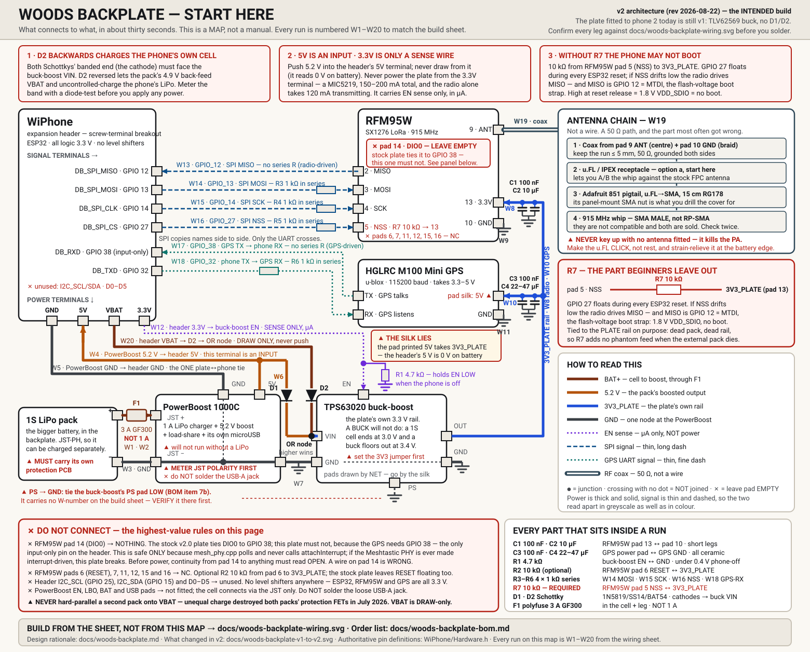

# WiPhone Meshtastic + Game Boy Firmware

Custom firmware for the **[WiPhone](https://www.wiphone.io/)** (an open-source
ESP32 cell phone) that adds:

- a two-way **[Meshtastic](https://meshtastic.org/)** radio node (the WiPhone's
  built-in LoRa radio speaks Meshtastic's on-air protocol — encrypted channel
  text **and encrypted direct messages with modern Meshtastic devices**, no
  phone, app, or internet required — plus shared map pins, distances to your
  people, and sunrise/sunset for wherever you are),
- a full-speed **Game Boy / Game Boy Color emulator** with sound, save states,
  and drag-and-drop ROM upload over WiFi,
- a **music player** (MP3 and WAV, stereo, hardware transport buttons, plays on
  while you use the rest of the phone),
- an **e-reader** (EPUB and text, pictures inline, your place saved, and
  position sync to another device over LoRa),
- **T9 predictive text** — five keypresses for "hello" instead of thirteen, with a
  25,000-word dictionary in flash, the old mode cycle on `#`, and room for your own
  vocabulary on the SD card,
- and phone quality-of-life fixes (real battery life, WiFi auto-switching,
  input reliability).

All of the WiPhone's normal phone / SIP / menu features stay intact.
Built with **PlatformIO** (the stock WiPhone firmware is Arduino-IDE only).

---

## 🔌 Install it from your browser — no tools needed

### ➡ **[nikguy321.github.io/wiphone-meshtastic](https://nikguy321.github.io/wiphone-meshtastic/)** ⬅

Plug the WiPhone into a computer with a USB cable, open the link in **Chrome or
Edge**, click **Install**, and pick the serial port that appears. About a
minute; the phone reboots itself when done. Nothing to install on the computer
— no Python, no command line. (Prefer doing it by hand? The PlatformIO route
below still works, and the phone's own **Settings → Firmware update** screen
carries both sets of instructions.)

---

## ⚠ You need an SD card — and a good one

Most of what makes this firmware worth having **lives on the SD card**: photos
and wallpaper, books, music, Game Boy ROMs and save states, chat history, the
`/health.log` the phone writes about itself. The phone boots and calls without
a card, but the apps above will be empty or refuse politely.

- **Format it FAT32.** The phone does not speak exFAT — and cards over 32 GB
  come exFAT from the factory, so a big card that "doesn't work" is almost
  always just this. Cards **up to 32 GB** format to FAT32 out of the box
  (Windows: right-click → Format → FAT32; macOS: Disk Utility → **MS-DOS
  (FAT)**, scheme MBR). For a larger card, use the
  [SD Association's formatter](https://www.sdcard.org/downloads/formatter/) or
  any tool that does FAT32 above 32 GB. No files or folders needed — the phone
  creates `/photos`, `/books`, `/music`, `/roms` and the rest itself.
- **Buy a decent card (a name brand, from a real seller).** The phone writes
  under real constraints — uploads stream to the card while WiFi runs, and the
  power switch is a hard cut, not a shutdown — and a weak or counterfeit card
  shows up as exactly the flakiness you'd blame on the firmware: uploads that
  die with SD errors, 0-byte files, photos that vanish. During 0.9.28's ~52 MB
  upload testing, a tired card threw three write errors that a fresh one
  wouldn't have (the transfer retried through them, but that's the margin
  you're spending).
- **Swap cards with the phone OFF.** The power switch cuts power outright, so
  off is off — but pulling a card from a running phone can corrupt whatever was
  half-written.

---

## What's new

Full detail in **[CHANGELOG.md](CHANGELOG.md)** — every release, including the
bug fixes and why each one happened. Recent highlights:

- **0.9.42** — Messages knows **who** you are talking to: conversations are labelled
  with the contact's name where your phonebook has one, and starting a new message to
  someone you have already texted opens that conversation instead of a second one
  beside it. Also: choosing a recipient no longer discards a message you had already
  typed.
- **0.9.33 – 0.9.41** — **T9 predictive text** (below), and the memory work that made
  it possible: the Nodes screen used to reboot the phone once the mesh got big enough,
  because menu rows were the one thing in the firmware still allocating from the ~20 KB
  internal heap rather than PSRAM. Also two latent panics on the typing path, and an
  adversarial review that found fourteen more bugs — including a dictionary that could
  not spell "cat".
- **0.9.28** — **the WiFi uploader is finally solid**: the upload page is served
  by the same lean single-connection engine that moves the file pieces, so
  loading it no longer eats the phone's memory and tripping the "site cannot be
  loaded" breaker — measured going from 2-of-10 page loads answered to 19–20 of
  20, and ~52 MB of test batches transferred with zero incidents. Also: the
  phone **auto-rejoins WiFi properly** (a one-way flag meant that editing any
  saved network quietly disabled auto-reconnect until reboot — found because a
  phone sat 78 minutes next to a hotspot it could join in seconds by hand).
- **0.9.9 – 0.9.27** — texting with delivery receipts, a Photos app + custom
  wallpapers, the e-reader syncing your place over the mesh, GPS/woods-backplate
  support, the screen lock actually locking, and a long tail of
  never-actually-ran code paths found and fixed — the changelog tells each story.
- **0.9.7** — the phone knows where everyone is: **Places** (shared map pins),
  live **distances and bearings** in the node list, **Sun & legal light**, and
  every list that used to run off the screen now wraps or ellipsizes.
- **0.9.6** — **direct messages work again with modern Meshtastic** (2.5+
  encrypts DMs with public-key crypto and silently drops the old form; the
  phone now speaks it natively).
- **0.9.5** — install from a browser, a **Files** app, and type-just-the-number
  texting (the server part of the address fills itself in).
- **Fixed since 0.9.7** (in the repo, riding the next release): a WiFi
  auto-switch deadlock that could leave the phone sitting next to a saved
  hotspot without joining it; GPS/woods-backplate support — and the plate now
  exists, is fitted to a phone and holds a live fix, so there is a
  [build guide](#woods-backplate); Sun and the GPS toggle moved into the menus
  — a feature that only exists as a serial command is not a feature.

---

## Game Boy Color emulator

Main menu → **Games → Game Boy**. Based on the retro-go fork of gnuboy, tuned
until real Game Boy Color games run at full speed on the phone.

- **Full speed with sound** — even heavy GBC titles. Sound plays through the
  phone's speaker; the **top two side keys** are volume up/down in-game.
- **Save states** — bookmark any game exactly where you are (pause → Save
  state), one slot per game, stored on the SD card.
- **Get games in over WiFi** — pick **Transfer ROMs...** in the game list: the
  phone becomes a tiny website (`wiphone.local`); drag `.gb`/`.gbc` files onto
  it from any computer, **or paste a download link** and the phone fetches the
  file itself. Uploads travel as small CRC-checked pieces, one in flight at a
  time, so a fast network cannot flood the phone's memory and a dropped
  connection resumes where it left off instead of starting over. Multiple files
  at once, per-file progress, and honest retries before complaining. Falls back
  to hosting its own hotspot (`WiPhone-ROMs`) when not on WiFi. If
  `wiphone.local` won't resolve —
  phone-hotspot networks and Android browsers often can't do mDNS — use the
  `http://<ip>` address the phone's screen shows instead.
- **Big carts work** — 4 MB ROMs stream from the SD card on demand.
- **Comes with a game** — uCity (public-domain) is built into the firmware, so
  there is something to play before any SD card or upload.
- **Housekeeping in the list** — Back on a ROM offers to delete it (with a
  confirm); long names scroll so you can read them.
- **Two screen modes** — crisp 1:1 or 1.5× Fill, toggled from the pause menu,
  which also shows the measured game speed %.
- **In-app help** — the **Help...** row documents the controls and everything
  else a new user needs.
- Heads-up: WiFi and calls are off while a game runs (they come back when you
  quit) — the radio's RAM is the price of full speed.

Controls: D-pad moves, bottom-right side key = **A**, the key above it = **B**,
Back = **Start**, Select = **Select**, End (hang-up) = **pause menu**.

---

## Music player

- **MP3 and WAV straight from the SD card** — nothing to convert. Menu > Music.
  (Format is detected from the file's content, so a mislabelled file still
  plays; a track that will not decode is skipped with the reason shown in the
  list, instead of ending the album.)
- **Stereo** through the headphone jack, loudspeaker otherwise, and it follows
  the jack live: unplug mid-song and it carries on out of the speaker from the
  same spot.
- **The four side buttons are the transport**, top to bottom: play/pause,
  next (**hold** = previous), volume up, volume down. Hold-for-previous does the
  usual thing — back a track within 3 seconds, restart the current one after.
  On the Now Playing screen, keypad **4/6** and D-pad left/right also skip.
- **Keeps playing when you leave the screen.** Read a book or check the mesh
  with music going; tracks advance on their own. A phone call always wins the
  speaker: music pauses for it and deliberately never barges back in on its own.
- Shuffle, repeat (off / all / one), and its own WiFi uploader (same
  `wiphone.local` page; hosts its own hotspot when off WiFi).
- Volume starts low on every boot and is separate from the call volume, so a
  quiet album can never leave you unable to hear the next call.

Decoding is the **Helix MP3 decoder** (RealNetworks, RPSL — vendored under
`WiPhone/src/audio/helix-mp3/`), with its ~29 KB of working memory placed in PSRAM, because the
internal heap on this phone has nothing like that spare. Measured on the device:
about a quarter of realtime at 48 kHz stereo, so there is plenty of headroom.

## Photos

**Menu → Tools → Photos** — a viewer for `/photos` on the SD card, and the one
place wallpaper is chosen. Rename, delete, and lock live behind the viewer; get
pictures in over WiFi with the phone's upload page (or `up on photos` on the
serial console).

**What it can show — this hardware decodes exactly two formats:**

| format | viewer | wallpaper |
|---|---|---|
| **JPEG, baseline** (what phone cameras produce) | ✅ | ✅ |
| JPEG, baseline **greyscale** | ✅ | ❌ (the wallpaper loader refuses it) |
| JPEG, **progressive** ("optimized" web/editor exports) | ❌ refused with a message | ❌ |
| **BMP, uncompressed 24/32-bit** | ✅ | ❌ (wallpaper is JPEG-only) |
| PNG / GIF / WebP / HEIC | — no decoder on this chip; not listed at all | — |

Photos up to **2 MB** open (decoded in PSRAM, scaled to fit); the same 2 MB
limit applies to wallpaper. In practice: pictures straight off a phone camera
just work; if an editor saved something as progressive JPEG or PNG, re-save it
as a plain (baseline) JPEG. Files the phone can't decode are deliberately not
listed rather than shown as a grey rectangle — and when you set a wallpaper,
the phone tests the real loader on the spot and repeats its verdict instead of
claiming success.

## E-reader

- **EPUB and plain text** from the card, with **pictures inline**. Menu > Books.
  Numbered pictures enlarge to full screen when you press that number key.
- **Books arrive over WiFi too** — the library's top row starts the same
  drag-and-drop upload page the emulator uses.
- **Three text sizes**, switched from the reader menu; your place is preserved
  across the change, and a **chapter list** jumps anywhere in the book.
- **Your place is saved** and survives the phone losing power without warning.
- Position is **(chapter, character offset)**, never a page number — so it still
  means something after you change the font size, and on a different device.
- **Greyscale JPEGs decode**, which the ESP32's built-in decoder cannot do at
  all (it handles 3-component colour only, and most book art is 1-component).
- **Book sync over LoRa** — share your reading position with another device on a
  private channel. Jumps are confirmed, never taken silently — and an offer
  whose clock looks wrong says so instead of being trusted. Diagnostics live in
  Books → menu → Sync settings.

## Meshtastic features

- **Two-way Meshtastic text messaging** on the default LongFast channel (US),
  AES-encrypted and interoperable with regular Meshtastic nodes.
- **Encrypted direct messages that modern Meshtastic accepts.** Meshtastic 2.5+
  requires public-key crypto for DMs and silently drops the legacy form — this
  phone speaks the real thing (X25519 + AES-256-CCM, keys learned automatically
  from NodeInfo, incoming DMs acknowledged). Proven against stock 2.7 hardware,
  both directions.
- **Multiple channels** — import custom channels from a Meshtastic share link
  (decoded on-device, no internet). Each channel shows up as its own chat.
- **Places** — waypoints shared on the mesh (camp, the truck, a stand) appear
  in **Meshtastic → Places**, with expiry and owner-locked edits. Pick one as
  your reference and the **Nodes list shows live distance and bearing** to
  everyone — "3.2km E of camp · 4 min ago".
- **"I'm here (announce)"** — declare yourself at a waypoint; the phone
  broadcasts one position so other devices' maps show it (preferring a private
  channel over public LongFast, and admitting it honestly when the send failed).
- **Sun & legal light** — dawn / sunrise / sunset / dusk and a countdown
  ("LEGAL LIGHT: 13h 34m left") for the reference place, computed offline.
- **GPS** — a receiver on the expansion header gives the phone its own live
  position; the toggle is in My node, and everything above works without it.
  The receiver rides on the **[woods backplate](#woods-backplate)** — built,
  fitted and holding a fix, with a full build guide below.
- **Node list** with friendly names (learned from NodeInfo), an **editable node
  name** (long and 4-character short), and a **configurable hop limit**.
- **Mesh client role** — relays/rebroadcasts other nodes' packets to extend the
  mesh's range (flood routing).
- **New-message notifications** — a status-bar icon (with unread counts per chat),
  a brief on-screen popup, plus a quiet "pop" sound and a short vibration
  (designed to be unobtrusive — e.g. usable as a communicator while hunting).
  Meshtastic has its own entry in the sound settings: ring+vibrate, vibrate
  only, or silent.
- **Persistent** message history, channels, places and keys across reboots.
- **Low-power green/black UI theme** for the Meshtastic app, and a Meshtastic
  icon on the main menu.
- **Handy extras** — hold **Select + Back** (the top-left and top-right corner
  keys) together for two seconds to turn the screen off.

The normal WiPhone experience (phone calls, SIP, contacts, games, settings) is
untouched.

---

## Woods backplate

The stock WiPhone back cover carries a LoRa radio and a small flexible antenna.
The **woods backplate** is a custom cover that swaps it for what you actually
want out in the trees: the same RFM95W radio but on a **real 915 MHz whip**, a
**GPS receiver** so the phone knows where it is (and so your position and your
Places go out on the mesh), and a **second, bigger battery** that charges the
phone from your pocket. It bolts onto the WiPhone's expansion header — no custom
PCB and no reflow oven, just wire, a soldering iron and an afternoon.

### ➡ **[Start here — the beginner's wiring map](https://github.com/Nikguy321/wiphone-meshtastic/blob/main/docs/woods-backplate-start-here.svg)** ⬅

One page: what every part is for, what plugs into what, and the ways to hurt
something. **Open this one first**, even if you have built things like this
before.

[](https://github.com/Nikguy321/wiphone-meshtastic/blob/main/docs/woods-backplate-start-here.svg)

*(The preview above is squeezed to README width and will be unreadable on a
phone — click it, or the link above it, to open it full size and zoomable.)*

Then, when you are ready to actually build:

- 🔧 **[The wiring sheet](https://github.com/Nikguy321/wiphone-meshtastic/blob/main/docs/woods-backplate-wiring.svg)** — the leg-by-leg build sheet: every pad,
  every capacitor leg, a numbered run list and a before-first-power checklist.
  **This is what you build from.** The map above is a map.
- 📦 **[The full order list](https://github.com/Nikguy321/wiphone-meshtastic/blob/main/docs/woods-backplate-bom.md)** — every part with prices, links, vendors,
  alternates and the reasoning behind each choice.
- 📐 **[The design doc](https://github.com/Nikguy321/wiphone-meshtastic/blob/main/docs/woods-backplate.md)** — why it is wired this way, and what was measured to
  prove it.

### Three things to get right *before* you order

⚠ **The pack needs its own protection board, and the diodes have a direction.**
This is a bare LiPo cell wired next to a phone that has its own LiPo cell. Buy a
pack with a protection PCB on it — not a naked cell. And when D2 goes in, meter
the band before you apply power: **D2 backwards lets the pack uncontrolled-charge
the phone's own battery**, which is the one mistake here that starts a fire.
Never hard-parallel the two packs onto VBAT either; that destroyed both packs'
protection FETs the last time it was tried. And **meter the JST polarity before
you plug the pack in** — red is *usually* positive, but Adafruit themselves warn
that the shell colours vary, and a reversed LiPo plug vents the cell.

⚠ **It needs a buck-*boost*, and the order list's Adafruit table still sells you
a buck.** Row 3 of that table (Adafruit 4711, TLV62569) is superseded — a buck
has a 3.4 V input floor and a 1S cell ends at 3.0 V. Order the **TPS63020**
module in the table below instead. While you are at it: **the two Schottky
diodes have no row in the order list at all**, so buying strictly off its tables
leaves you without them. They are in the table below.

⚠ **R7, the 10 kΩ pull-up, is not optional — without it the phone may not boot.**
The radio's chip-select pin floats during every ESP32 reset; if it drifts low the
radio drives the MISO line, and MISO is GPIO 12, which is the flash-voltage boot
strap. High at reset means the phone comes up dead-screen. One resistor.

The wiring map and the sheet carry the rest (SMA vs RP-SMA, never keying up
without an antenna fitted, the GPS pad whose silk screen lies, the polyfuse that
must not be 1 A). Read them; do not build from this page.

### What you have to buy

| Part | Why it is there | Where |
|---|---|---|
| **Already on hand** — RFM95W (SX1276 915 MHz) ×2 · HGLRC M100 Mini GPS · 1S LiPo (larger, **must have its own protection PCB**) · WiPhone Header Breakout (screw terminals) | the radio, the GPS, the pack, and the plate they all bolt to | you already have these — do not re-order |
| **SMA ↔ u.FL adapter cable, 15 cm RG178** | pigtail *and* panel-mount SMA bulkhead in one part — drill the cover for its nut | [Adafruit 851](https://www.adafruit.com/product/851) · $3.95 · ⚠ **SMA, not RP-SMA** |
| **PowerBoost 1000C** | the entire battery half: 1 A LiPo charger + 5.2 V boost + load-share + its own microUSB in | [Adafruit 2465](https://www.adafruit.com/product/2465) · $19.95 |
| **TPS63020 buck-boost module, 3.3 V** | the plate's own 3.3 V rail — the phone's 3.3 V pin cannot feed the radio | Amazon ASIN `B0H3KQ1VXJ` (DWEII 6-pack) · ~$13 · alt: Pololu S9V11E2F3 #5712 |
| **2 × Schottky diodes** (1N5819 / SS14 / BAT54) | D1 + D2 OR the pack's 5.2 V and the phone's VBAT into the regulator, so a dead pack cannot kill the radio | any assortment · D2's reverse blocking is safety-critical |
| **915 MHz whip antenna, SMA male** | the actual antenna | Amazon: `915MHz LoRa antenna SMA male 3dBi` · ~$11 · ⚠ **SMA male, not RP-SMA** |
| **Polyfuse, 3 A hold (GF300)** | sits in the cell-positive leg, which carries full boost *input* current (~1.9 A worst case) | Amazon: `PPTC resettable fuse 3A` · ~$8 · ⚠ **not 1 A** |
| **Resistor assortment** | 1 × 4.7 kΩ (EN pull-down) · 4 × 1 kΩ (R3–R6, anti-phantom-power) · 1 × 10 kΩ (**R7 NSS pull-up — required**) · opt. 1 × 10 kΩ (RESET) | Amazon: `resistor assortment kit` · ~$10 |
| **Ceramic capacitor assortment** | 2 × 100 nF + 1 × 10 µF (radio) + 1 × 22–47 µF (GPS) | Amazon: `ceramic capacitor assortment kit` · ~$12 |
| **u.FL / IPEX SMT receptacle** *(optional but recommended)* | lets you A/B the whip against the stock plate's known-good FPC antenna — the best deafness test you have | Amazon: `U.FL IPEX SMT receptacle connector PCB mount` · ~$8 |
| **JST-PH 2-pin pigtails** | so the pack can be split off for separate charging | Amazon · ~$8 |
| **Silicone hookup wire, 26–30 AWG** | thin and flexible — it has to survive the case closing | Amazon · ~$15 |

Two vendors: Adafruit (2 items) and Amazon (everything else). The Amazon rows are
written as **specs to match, not sellers** — those listings rotate constantly.
Prices were live on 2026-08-11; re-check before you total it up. Full 164-line
version, with the reasoning and the alternates, in
**[the order list](https://github.com/Nikguy321/wiphone-meshtastic/blob/main/docs/woods-backplate-bom.md)**.

### Where this stands

The plate is real: one is built, fitted to a phone and proven on air — the phone
charges from the pack, the radio TXes through the whip, and the GPS holds a live
fix (9 satellites, HDOP 1.1). But that built plate is the **v1** rail, and the
wiring sheet and the map above describe **v2**: the revision that adds the
buck-boost and the two diodes so the radio and GPS keep running on the phone's
own cell after the external pack dies. **Build v2** — it is the better design and
the sheet is correct — but do not read the sheet as a record of something already
tested end to end. The firmware half is done and shipping either way; the GPS is
off until you turn it on (**My node**, or `gps on` over serial).

---

## Predictive text (T9)

Five keypresses for "hello" instead of thirteen. Type `d-o-n-t` and get **don't** — the
apostrophe comes free, exactly as it did on the phones this is imitating.

It is **on by default**, with a **Settings → Predictive text** switch that remembers, and
the word being predicted shows in the footer rather than in your message, so nothing is
committed until you accept it.

| Key | What it does |
|---|---|
| **2–9** | build the word; the prediction appears in the footer |
| **UP / DOWN** | step through the other words on those digits — only while a word is pending, so they still move the cursor otherwise |
| **OK** | accept the word |
| **0** | space, and accepts the word first |
| **BACK** | un-types one **keypress**, not one letter |
| **`#`** | cycles **T9 → Abc → ABC → 123** — the classic escape, and 123 is how you type "testing 1 2 3" |
| **hold a number** | types the digit itself, without leaving T9 |
| **hold `#`** | capitalises the next word — for a name in the middle of a sentence |

Sentences capitalise themselves: the first word, and the first word after `.`, `!` or `?`.

Where it works: **message bodies** (Meshtastic and SIP) and the **note page**. Where it
deliberately does not: SIP addresses, WiFi passwords, IP addresses, the four-character
short name. A dictionary in a password field is a bug, not a feature, so every field opts
in explicitly and the default is off.

### Your own words

Jargon your dictionary has never heard of — unit names, callsigns, place names, a team
roster — goes in a plain text file at **`/t9/extra.txt`** on the SD card. It loads at boot
and its words are always offered **after** the built-in English ones, so they are there
when you want them and never in the way.

It is a file on the card and not part of the firmware on purpose: one person's vocabulary
has no business in a stranger's phone, and it means adding words is a file copy rather than
a reflash. `tools/gen_t9_extra.py` builds one from any word list; `up on t9` on the serial
console starts the WiFi uploader pointed at it, and `t9 reload` picks up the new file
without rebooting.

### Why it does not eat the phone

The dictionary is **25,000 words in flash** (`static const`, memory-mapped, read by plain
pointer dereference) and the engine **allocates nothing at all** — every buffer is a fixed
member. That is not tidiness: on this phone an internal-heap allocation failure inside
`new` throws, nothing catches it, and the phone aborts. The only safe amount of allocation
on the keypress path is none.

Cost: **+64 bytes of RAM**, 270 KB of flash, and a worst-case lookup of 25 binary-search
probes — about 0.05% of the 250 ms the firmware treats as a stall. The optional SD
dictionary lives in PSRAM and costs the internal heap nothing either.

---

## Texting

- **Conversations, not an inbox and an outbox.** Messages opens on a list of
  people, newest first, with unread counts on the row. Open one to see the whole
  exchange in order, oldest at the top, your messages headed `You · 2 min ago`.
  Reply is one press and already knows the address; each message also offers
  Reply/Delete when opened.
- **Named, not numbered.** A conversation is labelled with the contact's name
  wherever your phonebook has one — on the row, in the title when it is open, and
  above each message they sent. Only a stranger shows as a number.
- **One person is one conversation**, however the number is written — with the
  country code, without it, punctuated, or as a full SIP address. That includes
  starting one: **New Message → Choose someone you have already texted opens the
  conversation you already have with them**, rather than a second one beside it.
- **Type just the number.** A bare number is completed to
  `number@your-server` automatically, from your active SIP account — in the
  composer and when saving a phonebook contact. (It needs a SIP account to be
  active; without one, sends fail and the serial `sip` command says why.)
- ⚠ The list covers your **recent** conversations, not the entire history. Someone
  you have not texted in a long time may not be shown, and a long thread shows
  its newest messages with an honest "… N older messages not shown" line.

### Sharing a number with a second device

If another device uses the same phone number, the texts it sends can be mirrored
here so the two do not drift apart. Built for COVEY, a Raspberry Pi handheld, but
the wire format is plain text and easy to speak.

- **Over WiFi** you get the full history, including anything that arrived while the
  phone was off. **Over LoRa** you get new texts anywhere in radio range with no
  WiFi at all — as channel messages or encrypted DMs. Run both — a text already
  held is recognised and not shown twice.
- **Setup:** an `smsmirror.txt` on the SD card — the other device's address,
  then its shared token (optional third line: the port; default 8087). Upload it
  with the usual WiFi upload page (the phone also looks in `/roms`, which is
  where that page writes). The file is re-read every 30 seconds, so changes take
  effect without a reboot. No file means the feature is off, and the phone says
  so on serial instead of failing quietly.
- **Notifications behave**: texts you sent from the other device arrive silently,
  and catch-up history older than ten minutes never buzzes — only a genuinely
  new incoming text does.
- If the mirror ever seems stuck, delete `/roms/smsmirror.since` on the card —
  the phone refetches everything and deduplicates.
- ⚠ **Use a dedicated mesh channel.** An invite link contains the channel key, so
  sharing it gives away everything else on that channel.
- ⚠ **The WiFi side is cleartext** — this phone cannot do HTTPS at all
  ([why](#why-there-is-no-over-the-air-update)). The token stops a stray browser, not
  someone watching the network. Turn it off on networks you do not trust; the LoRa
  side is encrypted by the channel key.

---

## Serial console

Plug in USB, open a terminal at **500000 baud**, type `?`:

| command | does |
|---|---|
| `up on` / `up on books\|photos\|t9` / `up off` / `up` | start / stop the WiFi upload page (into `/roms`, `/books`, `/photos` or `/t9`); show its address |
| `t9` / `t9 on\|off` / `t9 reload` | predictive text: state and how many extra words are loaded; switch it; re-read `/t9/extra.txt` without rebooting |
| `heap` | memory truth: internal/DMA/PSRAM free + largest + floor since boot |
| `wifi scan` | what the radio can actually hear — deaf radio vs absent AP |
| `wifi calreset` / `wifi restore` | erase the RF calibration / the WiFi driver's stored state, and reboot — the deaf-radio probes (⚠ `restore` forgets the last-used network) |
| `sync` / `mirror` | fetch mirrored texts now; mirror status |
| `sip` | SIP account state — loaded, registered, WiFi — in one line |
| `chan <url>` / `chans` | apply a Meshtastic channel invite link; list channels |
| `dm <!node> <text>` | send a direct message (encrypted when the key is known) |
| `announce` / `pki` | broadcast NodeInfo now; DM crypto state |
| `pos` | the whole positions picture: places, node fixes, pin, reference |
| `sun` | legal light at the reference place (or `sun <lat>,<lon>`) |
| `gps` / `gps on\|off` | GPS receiver state / route the user UART to it |
| `unread` / `unread clear` | recount + repair unread counters; mark all read |
| `bookpage` | dump the open reader page's layout (debugging) |

For the things that otherwise need the phone in your hand — handy when it is on
a bench instead. **No authentication:** whoever holds the cable holds the phone.

---

## Phone improvements

- **WiFi auto-switch** — the phone quietly scans in the background and hops to
  the strongest *saved* network (with hysteresis, so it doesn't ping-pong);
  waking the screen with no connection triggers an immediate scan+connect, and
  out-of-range scanning backs off to save battery, recovering the moment
  anything connects. Toggle under **Settings → WiFi auto-switch**.
- The **status bar shows the connected WiFi network's name**.
- Fixed the **"Edit current network"** screen freezing on input, and the
  multi-second menu freezes caused by DNS lookups (answers are cached now,
  including the "that name does not resolve" answer that used to freeze the
  phone over and over on restrictive networks).
- **Keypad reliability** — fixes for missed taps, stuck buttons, and held keys
  releasing at random (I2C error retry + a 40 ms hardware key heartbeat).
- **Real battery life.** The main loop used to spin flat out at 240 MHz forever
  with the screen off; it now sleeps between passes, drops the CPU to 80 MHz
  when nothing is happening, and lets the WiFi receiver park between beacons.
  Full speed returns instantly for the screen, music, a call, the emulator or an
  upload.
- **The phone records why it restarted** — crash, watchdog, brownout or a normal
  power-on — plus a health line every minute (memory, battery, CPU speed) to
  `/health.log` on the card. The log trims itself (newest ~4 hours kept), and is
  readable over WiFi at `http://wiphone.local/log` with an upload screen open
  (use `curl -L` — since 0.9.28 that address redirects to the legacy server on
  port 8080), so it survives being unplugged and rebooted.
- **File transfers work from a phone — and now reliably.** The upload page has a
  proper file button and a paste-a-link fetch, retries failed pieces, raises the
  screen timeouts while open (dim 5 min / sleep 10), and no longer knocks the
  phone off WiFi. Since **0.9.28** the page itself is served by the same lean
  single-connection engine that carries the file pieces (zero heap cost per
  request), so visiting it can no longer trip the low-memory breaker that used
  to answer "site cannot be loaded" — the old framework server still exists on
  port **8080** for `curl -F` and no-JavaScript browsers. From a computer,
  `python3 tools/wiphone_send.py --app books <files>` uploads a batch in one
  command, resuming partial files and byte-verifying each one.

---

## Firmware updates

**Updates are installed over USB.** See [Flashing](#flashing-beginner-friendly)
below — it is the same `pio run -t upload` you used the first time, and it keeps
your settings, books, ROMs and messages.

**Settings > Firmware update** on the phone shows those steps on the screen, so
you can read them with the phone in your hand.

### Why there is no over-the-air update

The phone cannot open an HTTPS connection, so it can never download an update by
itself. This is a memory limit, not a broken link or an expired certificate:

| | |
|---|---|
| mbedTLS needs (`CONFIG_MBEDTLS_SSL_MAX_CONTENT_LEN` 16384, in **and** out buffers) | **~33 KB** |
| may any of it come from PSRAM? (`CONFIG_MBEDTLS_EXTERNAL_MEM_ALLOC`) | **no, not set** |
| free internal heap on this phone | **~19 KB** |
| largest contiguous internal block, fresh boot | **~14.9 KB** |

The TLS handshake fails in `client->connect()` before a single byte of HTTP.
It is not close, and it is not fragmentation — there is not enough internal heap
even on a perfectly clean boot. The OTA controls have been removed rather than
left to report an error every time, and the boot-time update check is compiled
out entirely (`OTA_TRANSPORT_AVAILABLE` in `WiPhone/ota.h`) so the phone no
longer spends part of every startup on a connection that cannot open.

Changing this means changing the **transport** — a plain-HTTP mirror, or a TLS
stack that can allocate from PSRAM — not the URL. The code is still there and
still builds; flip `OTA_TRANSPORT_AVAILABLE` to `1` once the transport is real.

## Applying a channel setup link

Meshtastic shares channel setups as a link that looks like:

```
https://meshtastic.org/e/?add=true#CgcSAQE6AgggCjISIA-e2sF5bAtEulPtEtsB…
```

**Only the part after the `#` matters.** Everything before it
(`https://meshtastic.org/e/…`) is just a web redirect and contains no channel
data — the base64 text *after the `#`* is the entire channel configuration.

**To add channels to the WiPhone:**

1. On any Meshtastic device or the Meshtastic app, open your channel's **share /
   QR link** and copy it.
2. Send that link to the WiPhone **as a Meshtastic direct message**. You can send
   the whole URL, or — if it's too long to fit in one message — just the part
   **after the `#`** (that fragment is usually short enough on its own).
3. On the WiPhone: open **Meshtastic → Chats**, open the direct-message thread
   from that sender, **select the message** containing the link, and press
   **OK ("Apply link")**.
4. The custom channels are imported and appear as their own chats. They persist
   across reboot.

Applying a link **adds/merges** channels (it keeps your existing ones, including
LongFast). Decoding happens entirely on the device — **no internet needed.**

---

## Hardware

Made for **WiPhone** hardware:
- ESP32-WROVER (240 MHz, PSRAM, 16 MB flash)
- Semtech SX1276 LoRa radio (RFM95W), US 915 MHz / LongFast
- ST7789 display, CP2104 USB-to-serial

Optional add-on: the **[woods backplate](#woods-backplate)** — a custom back
cover with a bigger battery, a GPS receiver and a real 915 MHz whip antenna.

---

## Flashing (beginner-friendly)

You'll build and flash the firmware with **PlatformIO**. On a Mac / Linux /
Windows machine:

**1. Install Python 3** (if you don't have it): <https://www.python.org/downloads/>

**2. Install PlatformIO Core:**
```bash
pip3 install -U platformio
```

**3. Get this code** — clone or download this repository (use the green **Code**
button at the top of the page), then open a terminal in the project folder.

**4. Plug in the WiPhone** via USB. (On some systems you may need the Silicon Labs
CP210x USB-to-UART driver; macOS usually has it built in.)

**5. Build and flash the firmware:**
```bash
pio run -t upload
```
PlatformIO auto-detects the WiPhone's serial port. If it can't find it, list ports
with `pio device list` and add `--upload-port /dev/<your-port>`. If the upload
starts and then fails partway ("Invalid head of packet" is the classic), your
USB-serial doesn't like full speed — set `upload_speed = 230400` in
`platformio.ini` and try again.

**6. First time only — also flash the filesystem** (config files, the ringtone,
the wallpaper):
```bash
pio run -t uploadfs
```

That's it — the WiPhone reboots into the firmware. Open the main menu and look for
**Meshtastic**.

> Tip: to watch the phone's logs, run `pio device monitor` — the project pins the
> monitor to the WiPhone's **500000 baud** console, so it works as-is.

---

## Credits & license

Based on the official [WiPhone firmware](https://github.com/HackEDA/wiphone-firmware)
by HackEDA, Inc., whose code is under the **WiPhone Public License v1.0**.

**This repository as a whole is distributed under GPL v3** (`LICENSE`). It has to be:
RadioHead is compiled into every build and is offered as "GPL V3 or commercial", and
GPLv3 is the only licence that can cover the rest of the mix. HackEDA's original files
keep their own WPL headers, which is fine — the WPL is Apache-2.0-derived, and Apache 2.0
combines one-way into GPLv3.

Two vendored components do not sit cleanly under that, and rather than pretend otherwise
they are itemised in **[THIRD-PARTY-NOTICES.md](THIRD-PARTY-NOTICES.md)**: the Game Boy
emulator core (gnuboy, GPL v2 with no "or later" clause found) and the MP3 decoder (helix,
RealNetworks RPSL, which the FSF lists as GPL-incompatible). For a phone you build and
flash yourself this is moot — every obligation involved is about distribution, and the
source is public. It would need resolving before the project could be redistributed as one
clean work; that file says how.

Meshtastic is a trademark of Meshtastic LLC; this is an independent, community project,
not affiliated with or endorsed by Meshtastic.
